### 🎯 What is it?

**Face-Point** is the **first open-source real-time face filter app** built using **MediaPipe FaceMesh** for high-performance, GPU-accelerated effects — and it’s blazing fast thanks to its **pure OpenGL** rendering pipeline.

> ⚡ No OpenCV. No fluff. Just raw OpenGL power.

---
~~# 🐞 Known Issues~~ [FIXED]

~~## 🧨 Shader Crash: `sampler3D` on Mali GPUs~~

~~### 🔍 Issue Summary~~

~~On some Mali GPUs (often found with MediaTek CPUs), `sampler3D` isn’t supported.~~  
~~As a result, when we fall back to using `sampler2D` for LUTs, the colours can appear slightly inaccurate.~~

### 🛠️ Fix Log

- **18-09-2025** → ✅ Fixed **`sampler3D` crash** on Mali GPUs by replacing it with `sampler2D` for both **Mali** and **Adreno**, keeping the **same visual quality** with manual slice interpolation.
- **19-09-2025** → ✅ Fixed ** fixed Abstract screen glitch noise on last BW1.cube filter** by replacing it with original `BW1.cube` file.
---

### 🧵 Tech Stack Highlights

- 🧠 **MediaPipe FaceMesh** for facial landmark detection
- 🎮 **Pure OpenGL** for rendering — no OpenCV involved
- 📱 Optimized for Android with native performance
- 🧩 Modular design for custom filters and effects

---

### 📚 Credits & References

- 🎥 **Encoder Logic**: Based on [EncodeAndMuxTest.java](https://bigflake.com/mediacodec/EncodeAndMuxTest.java.txt) from Bigflake — a robust reference implementation for MediaCodec + MediaMuxer workflows
- 🖼️ **Offscreen Rendering**: Uses `EglSurfaceBase` and `EglCore` from Google’s [Grafika test app](https://github.com/google/grafika)
- 🧠 **Face Landmark Detection**: Utilizes Google’s [MediaPipe Face Landmarker](https://ai.google.dev/edge/mediapipe/solutions/vision/face_landmarker/android) — official model and API used for high-accuracy facial tracking
- 🎨 **3D LUT Filter**: Inspired by [Svante Lindgren’s guide](https://svnte.se/3d-lut) on creating GPU-accelerated 3D LUTs from `.CUBE` files using OpenGL `GL_TEXTURE_3D` — enables DaVinci Resolve or Photoshop-style color grading directly in-app. LUTs can be embedded through code (for now), allowing custom cinematic looks and stylized filters with real-time performance.

---

### 🚫 Current Limitations

- 🎙️ **Audio recording is not supported yet**
  - Planned upgrade: **voice changer integration**
  - MediaCodec logic will be **migrated from Kotlin to C++** to eliminate processing overhead and boost performance

---

### 🔥 Why It Stands Out

- Built from scratch with precision and performance in mind
- Designed for real-time responsiveness on mobile GPUs
- Ideal for developers who want full control over rendering and effects

## 🎨 Filter Preview Grid

| Filter Name | Preview |
| ----------- | ------- |
| `1_default` | 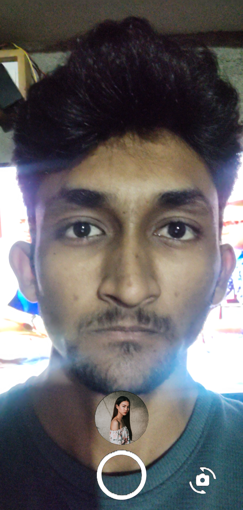 |

| Filter Name       | Preview                                                                 | Filter Name       | Preview                                                                  |
|-------------------|-------------------------------------------------------------------------|-------------------|---------------------------------------------------------------------------|
| `2_monkey`        | 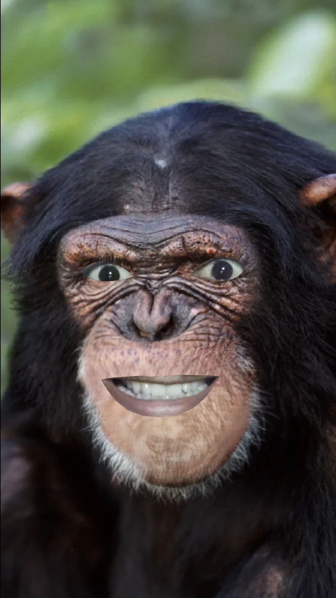              | `3_eye_censor`    | 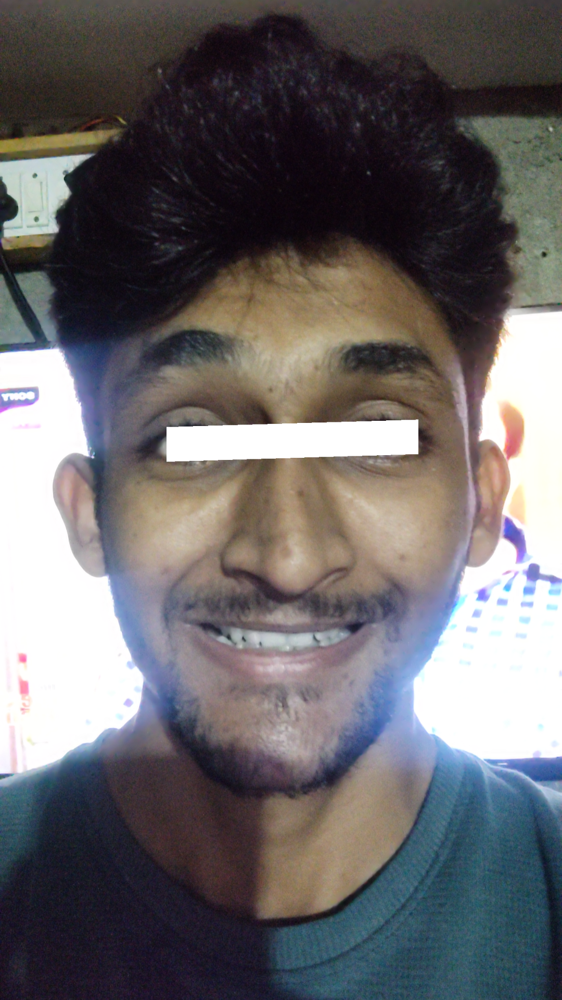           |
| `4_googly_eyes`   | 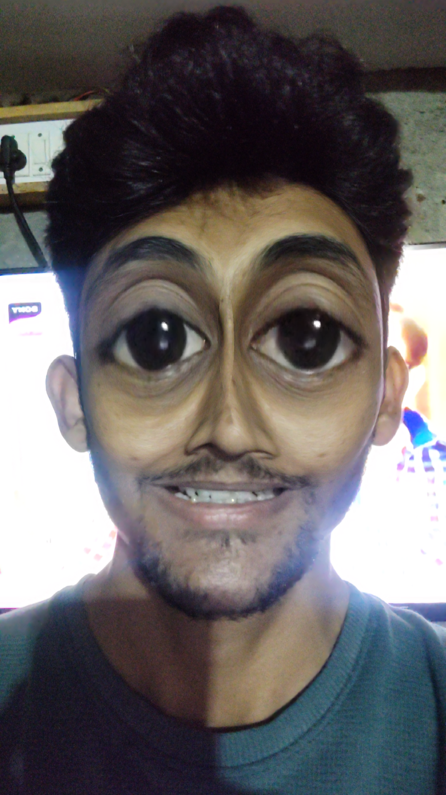         | `5_chad`          | 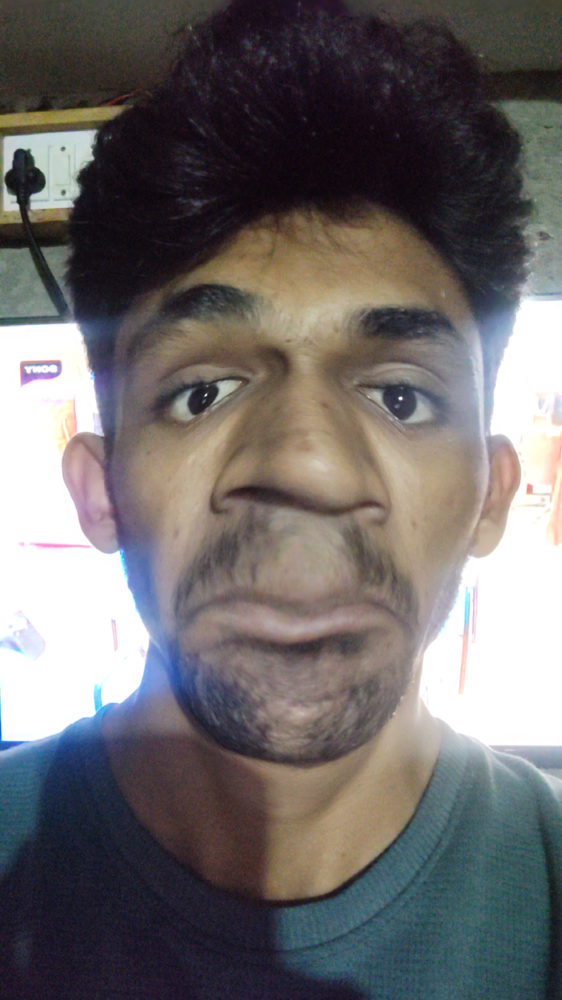                 |
| `6_glsses`        | 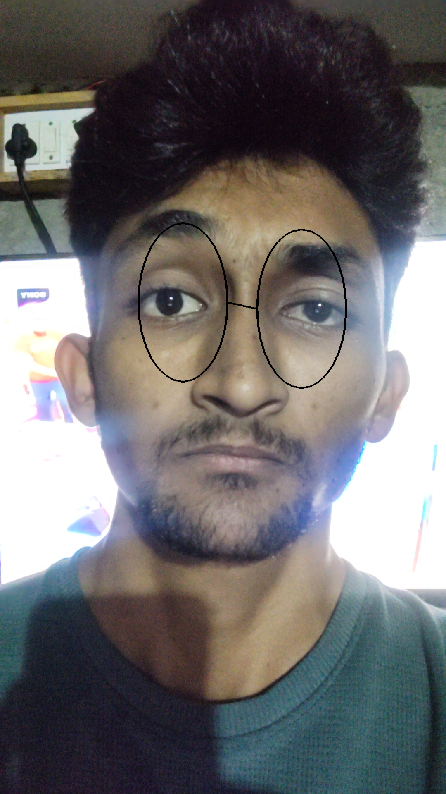              | `7_invert`        | 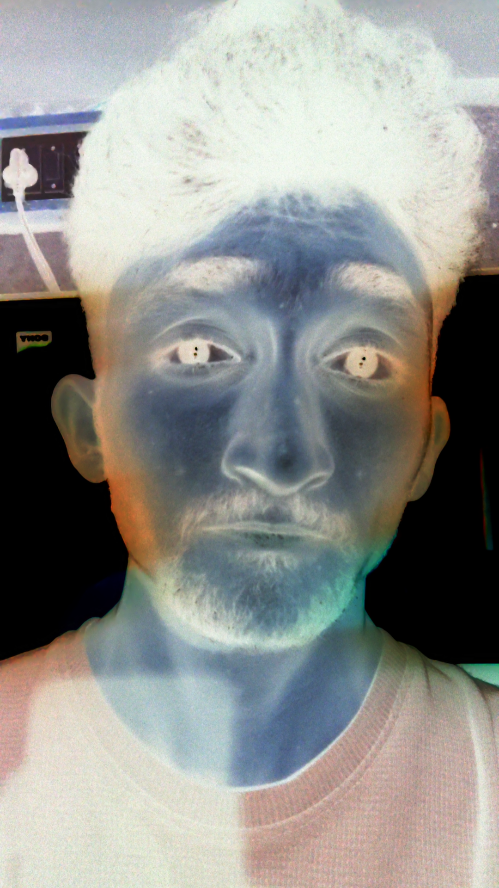               |
| `8_b&w`           | 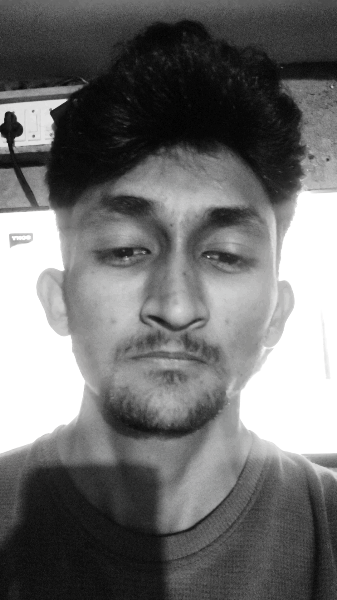                 | `9_cine_still`    | 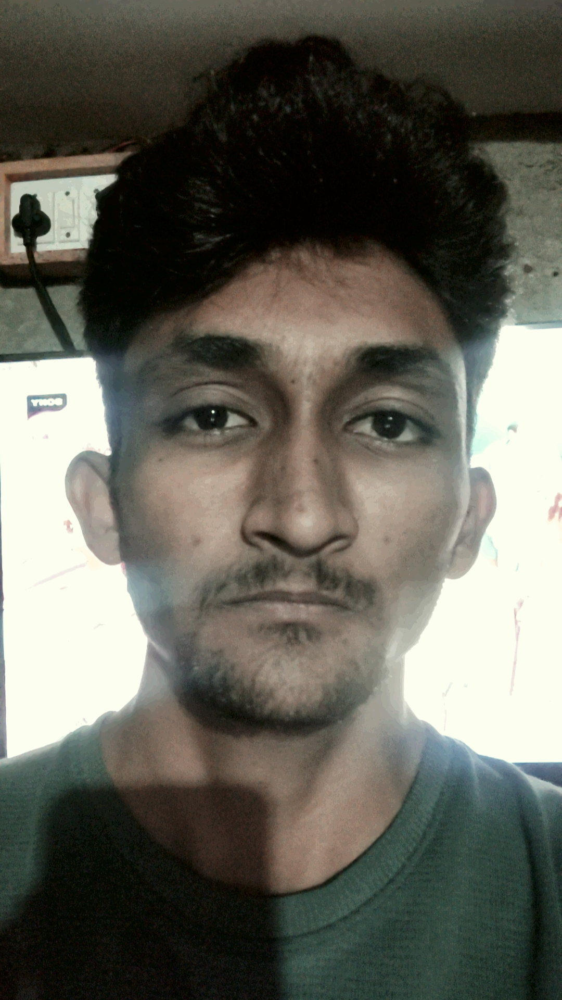           |
| `10_sunset`       | 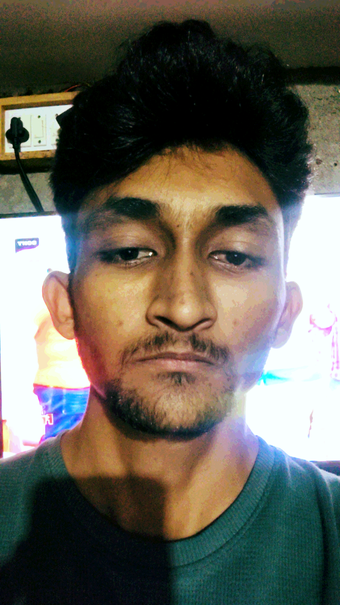             | `11_sunset_2`     |             |
| `12_BW1`          | 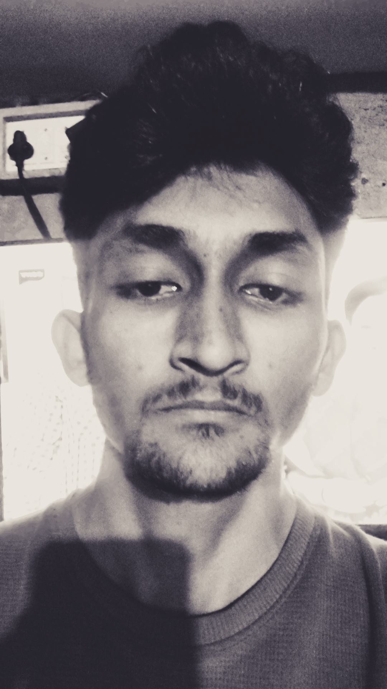                | Coming Soon...    | ☁️☁️☁️☁️☁️☁️☁️                                                           |

~~# 🐞 Known Issues~~ [FIXED] 

~~## 🧨 Shader Crash: `sampler3D` on Mali GPUs~~

~~### 🔍 Issue Summary~~

~~On some Mali GPUs (often found with MediaTek CPUs), `sampler3D` isn’t supported.~~  
~~As a result, when we fall back to using `sampler2D` for LUTs, the colours can appear slightly inaccurate.~~

### 🛠️ Fix Log

- **18-09-2025** → ✅ Fixed **`sampler3D` crash** on Mali GPUs by replacing it with `sampler2D` for both **Mali** and **Adreno**, keeping the **same visual quality** with manual slice interpolation.